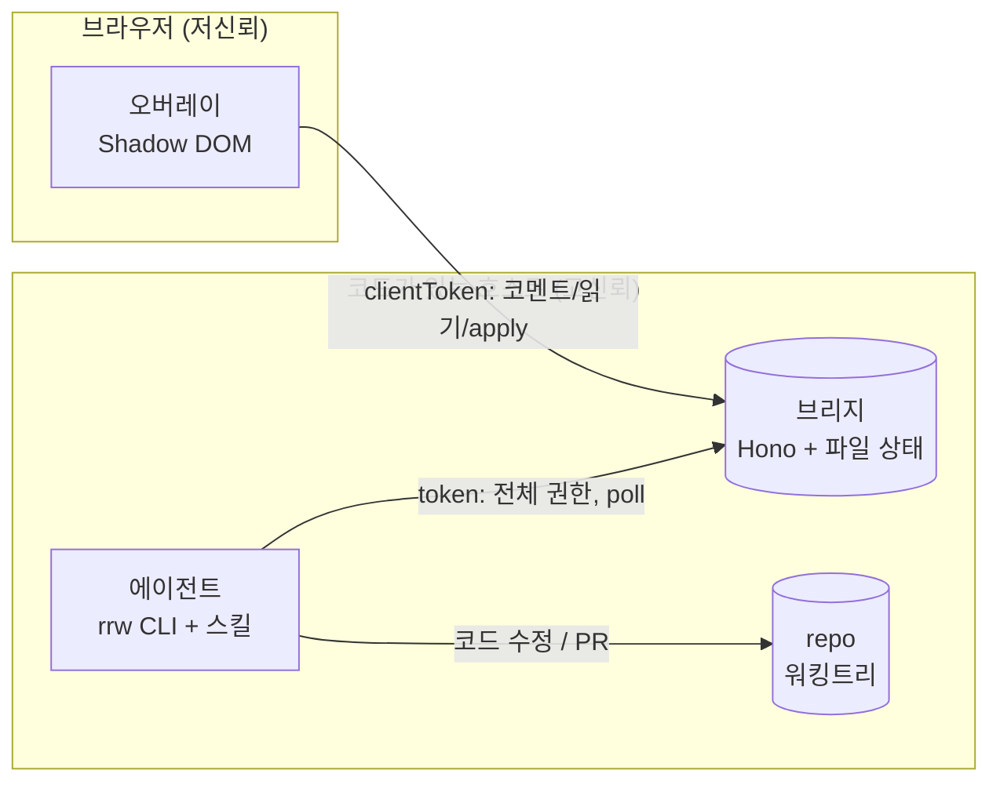
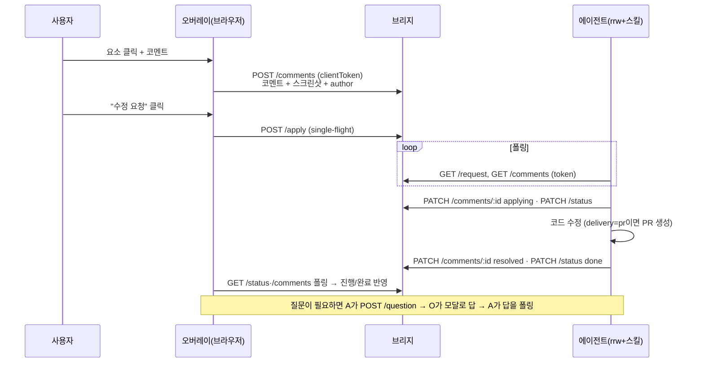
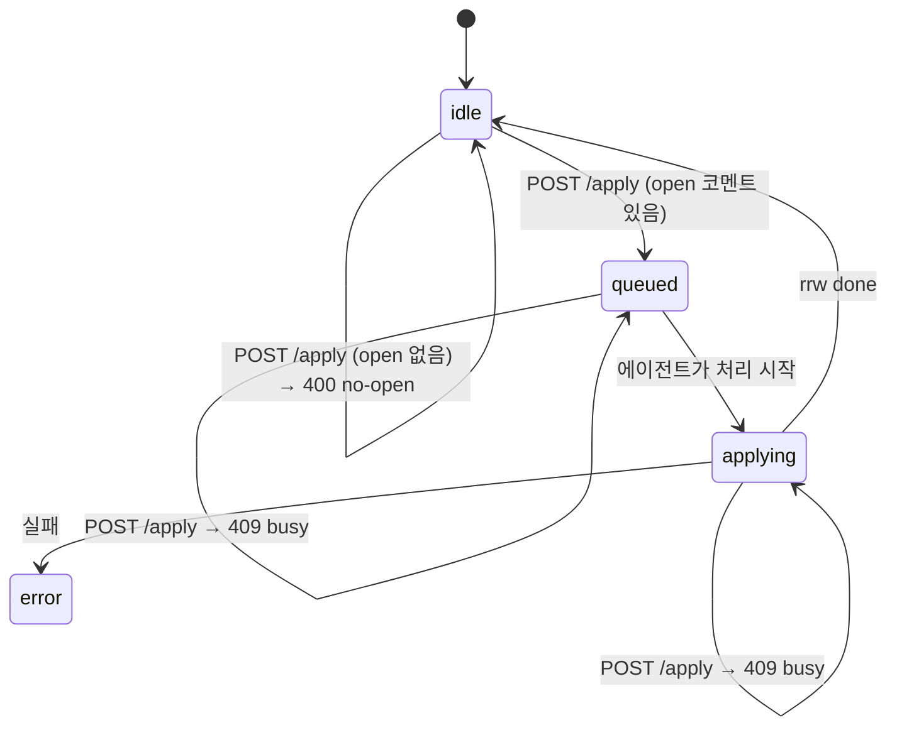
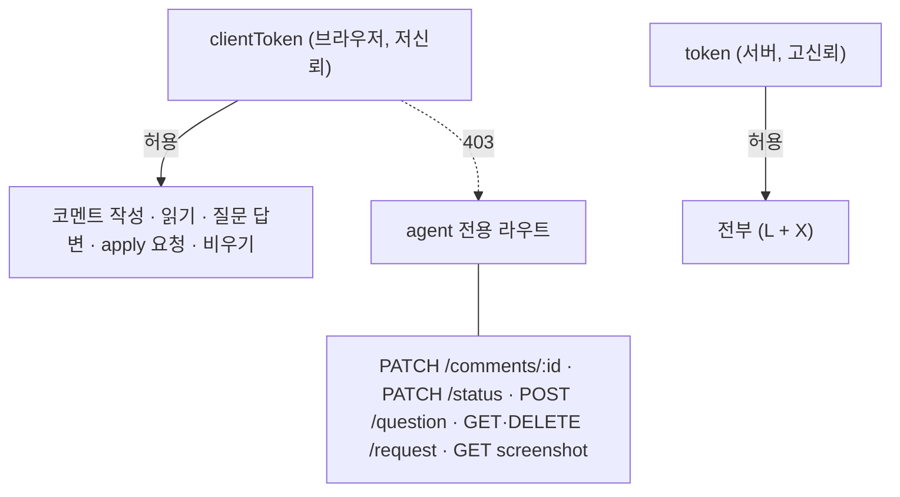

# 아키텍처

roto-remote-works는 **브라우저 오버레이 · 브리지 · 에이전트** 세 부분으로 나뉜
pnpm 모노레포입니다. 셋은 직접 호출하지 않고 **브리지의 HTTP API + 파일 상태**를
통해서만 통신합니다. 덕분에 각 부분을 독립적으로 교체·테스트할 수 있습니다(예:
에이전트를 Claude 대신 Codex로, 오버레이를 다른 호스트에서).

## 한눈에



- 오버레이는 **저신뢰 토큰**으로 코멘트 작성·상태 읽기·apply 요청만.
- 에이전트는 **고신뢰 토큰**으로 브리지를 폴링하며 코멘트를 적용.
- 브리지는 **단일 진실 공급원**이자 둘 사이의 비동기 메시지 브로커.

## 패키지

| 패키지 | 역할 | 핵심 의존 |
|---|---|---|
| `packages/bridge` | Hono 서버 + 파일 상태 저장소(`Store`) + `rrw-bridge` CLI. 코멘트/apply요청/진행/질문의 단일 진실 공급원. | hono, @rrw/config |
| `packages/overlay` | React+Vite+Tailwind 오버레이. 호스트 앱에 vendoring되어 Shadow DOM에 렌더. 요소 선택·코멘트·스크린샷 캡처. | react, html2canvas |
| `packages/agent` | `rrw` CLI(pull/status/resolve/ask/run/worker) + 처리 로직(worker 루프, PR delivery). | @rrw/bridge(타입), @rrw/config |
| `packages/config` | `rrw.config.json` 로더(`loadConfig`). bridge·agent·overlay가 공유. | — |

## 데이터 흐름 (코멘트 → 적용)



## 브리지 상태와 저장소

브리지는 DB 없이 데이터 디렉터리(`bridge.dataDir`, 기본 `.rrw/.rrw-data`)의
JSON 파일로 상태를 관리합니다. 쓰기는 뮤텍스 + 임시파일+rename으로 원자적입니다.

| 파일 | 내용 |
|---|---|
| `comments.json` | 코멘트 배열 (id, comment, status, author, selector, screenshot 경로 등) |
| `request.json` | 현재 apply 요청 (requestedAt, origin, ids) |
| `status.json` | 진행 상태 (state, currentStep, perComment) |
| `question.json` | 진행 중인 web-ask 질문 |
| `screenshots/<id>.png` | 코멘트별 뷰포트 스크린샷 (comments.json엔 경로만) |

상태 열거형:
- **CommentStatus**: `open` → `queued` → `applying` → `resolved`
- **RunState**(status.state): `idle` · `queued` · `applying` · `done` · `error`
- **ApplyOrigin**: `local` · `remote`
- **QuestionStatus**: `pending` · `answered` · `cancelled`

## apply는 single-flight

동시 편집 충돌을 막기 위해 한 번에 한 배치만 처리합니다.



`POST /apply` 응답: 수락 **202** / open 없음 **400** / 이미 진행 중 **409**.

## 리버스 채널

브리지→사용자 방향 채널이 둘 있습니다(에이전트가 쓰고 오버레이가 폴링):
- **진행(status)**: 에이전트가 `PATCH /status`로 현재 단계/코멘트별 상태를 기록 →
  오버레이 ProgressPanel에 표시.
- **질문(web-ask)**: 에이전트가 `rrw ask`(=`POST /question`)로 질문 등록 →
  오버레이 모달로 답 → 에이전트가 답을 폴링. 터미널이 없는 헤드리스/원격에서도
  동작하는 핵심 장치.

## 신뢰 경계 (2-토큰)



핵심: 오버레이는 `rrw.config.json`을 번들에 포함하므로, 2-토큰 모드에서는 고신뢰
`token`을 파일에 넣지 말고 `RRW_TOKEN` 환경변수로 서버 측에만 둡니다. 자세한 내용은
[SECURITY.md](../SECURITY.md).

## 처리 모드 & delivery 결정

```mermaid
flowchart TD
  Q1{사람이 붙어<br/>인터랙티브?} -->|예, 로컬| S["mode=session<br/>현재 세션이 rrw-process로 적용"]
  Q1 -->|아니오, 무인| W["mode=worker<br/>요청마다 claude -p / codex exec spawn"]
  W --> Q2{서버가 HMR로<br/>즉시 반영?}
  Q2 -->|예 (테스트서버)| IP["delivery=in-place<br/>워킹트리에 그대로"]
  Q2 -->|아니오 (빌드/배포)| PR["delivery=pr<br/>브랜치·커밋·PR"]
```

`rrw run`이 설정된 `processing.mode`/`delivery`대로 디스패치합니다.

## 확장점

- **에이전트 추가**: 모든 에이전트는 `rrw` CLI + 브리지 HTTP + 에이전트-중립
  [`docs/PROTOCOL.md`](./PROTOCOL.md)만 공유하면 됩니다. Claude 어댑터는
  `skills/rrw-process`, Codex 어댑터는 `adapters/codex/AGENTS.md`. 새 러너는
  `packages/agent/src/runners.ts`의 `agentCommand`에 한 줄 추가.
- **설정 확장**: `packages/config`의 `loadConfig`에 필드를 더하면 세 곳이 함께 읽음.

## 설계 스펙

초기 설계 논의는 [`docs/specs/2026-05-31-design-comments-design.md`](./specs/2026-05-31-design-comments-design.md).
